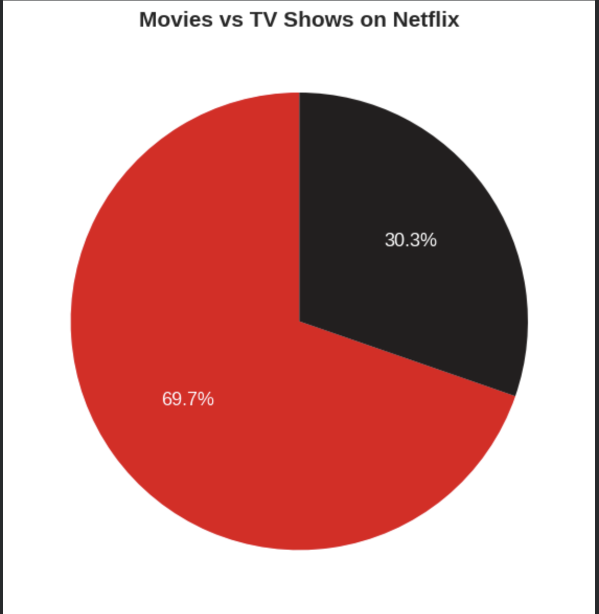
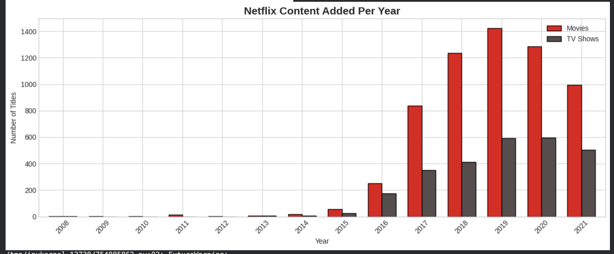
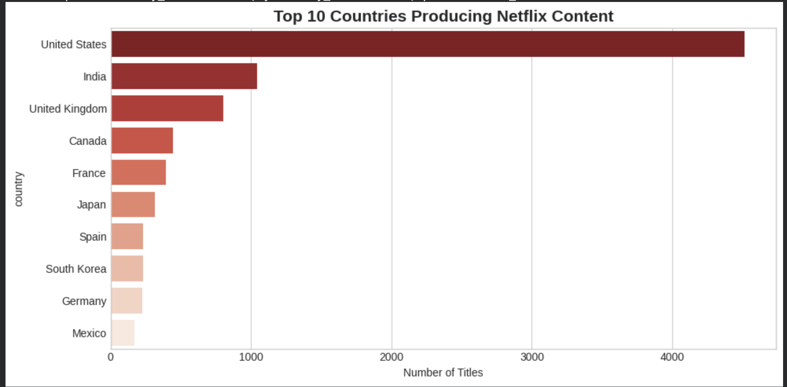
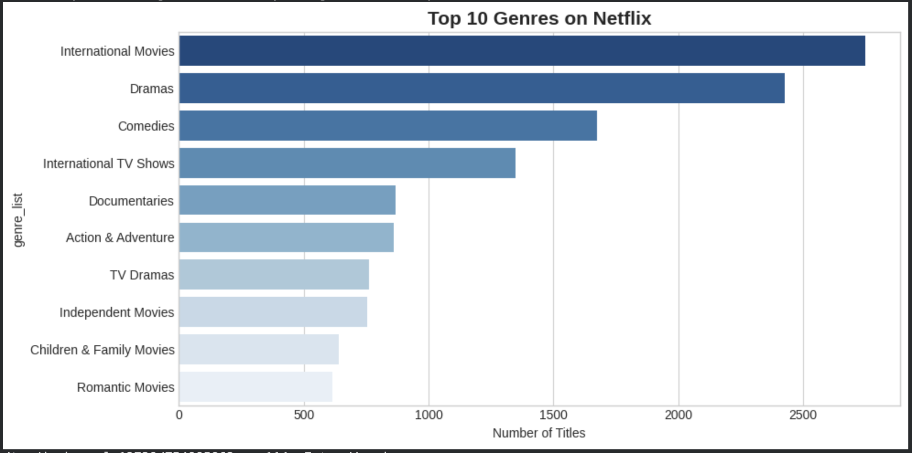
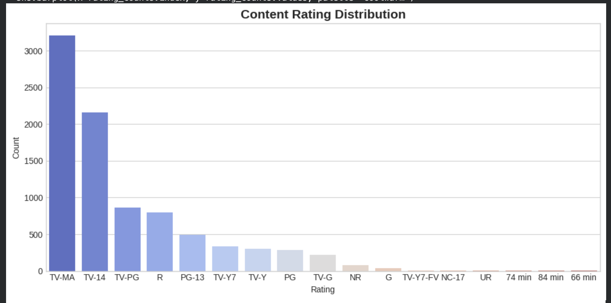
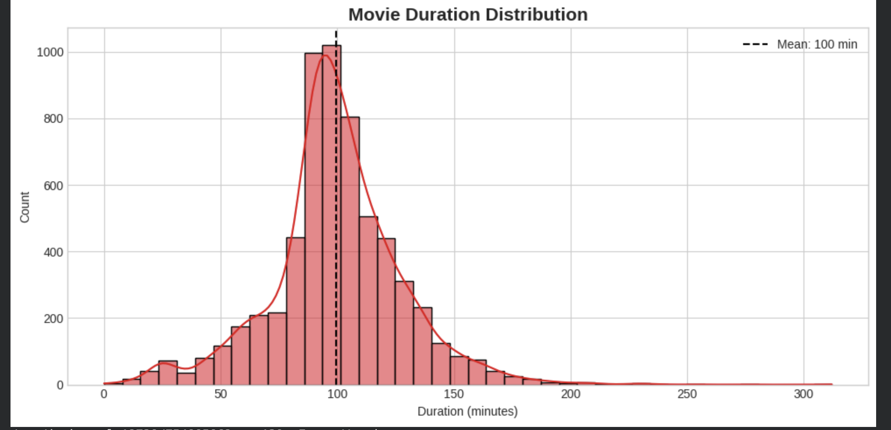
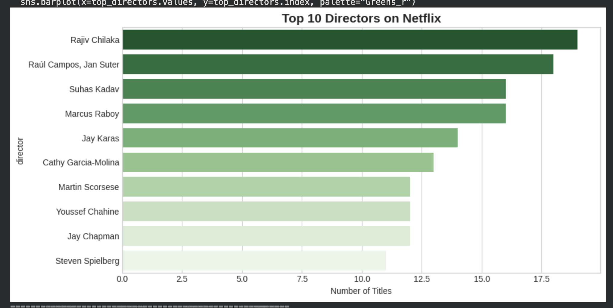

# 📊 Netflix Data Analysis using Pandas & NumPy

End-to-end data analysis project on Netflix's content library —
uncovering trends, patterns, and insights from 8,800+ titles
using Python data science libraries.

---

## 🎯 Objective

Perform complete data analysis on the Netflix dataset including
data cleaning, transformation, visualization, and insight
extraction to support content strategy decisions.

---

## 💡 Key Insights Discovered

- 🎬 **69%** of Netflix content is Movies, **31%** is TV Shows
- 🇺🇸 **USA** is the top content-producing country by far
- 📅 Netflix added the **most content in 2019**
- 🎭 **International Movies** is the most common genre
- ⏱️ Average movie duration is **~99 minutes**
- ⭐ **TV-MA** is the most common content rating

---

## 🛠️ Tech Stack

| Tool | Purpose |
|---|---|
| Python | Core language |
| Pandas | Data loading, cleaning, transformation |
| NumPy | Numerical operations |
| Matplotlib | Charts and visualizations |
| Seaborn | Statistical visualizations |
| Google Colab | Development environment |

---

## 📁 Dataset

[Netflix Movies and TV Shows — Kaggle](https://www.kaggle.com/datasets/shivamb/netflix-shows)

- 8,800+ titles
- 12 features
- Covers 2008–2021

---

## 🔄 Project Workflow

Raw Data (CSV)
↓
Data Loading & Inspection
↓
Data Cleaning (null values, data types, formatting)
↓
Data Transformation (feature extraction, parsing)
↓
Exploratory Data Analysis (EDA)
↓
7 Visualizations Created
↓
Key Insights Extracted
↓
Summary Report Exported (CSV)

---

## 📷 Visualizations

### Movies vs TV Shows

### Content Added Per Year

### Top 10 Countries

### Top 10 Genres

### Rating Distribution

### Movie Duration Distribution

### Top 10 Directors

---

## 📊 Key Metrics

| Metric | Value |
|---|---|
| Total Titles Analysed | 8,800+ |
| Countries Represented | 100+ |
| Unique Genres | 42 |
| Avg Movie Duration | ~99 mins |
| Most Productive Year | 2019 |
| Top Country | United States |

---

## 🚀 How to Run

1. Open notebook in Google Colab
2. Download dataset from Kaggle
3. Upload `netflix_titles.csv` to Colab
4. Run all cells top to bottom
5. All charts auto-save as PNG files

📓 [Open in Google Colab](YOUR_COLAB_LINK_HERE)

---

## 📌 Future Improvements

- [ ] Build an interactive dashboard using Plotly
- [ ] Add time series forecasting for content trends
- [ ] Compare Netflix vs other streaming platforms
- [ ] Sentiment analysis on descriptions

---

## 👤 Author

**Your Name**
📧 your.email@gmail.com
🔗 [LinkedIn](https://linkedin.com/in/yourprofile)
🐙 [GitHub](https://github.com/yourusername)

---

## ⭐ If you found this useful, give it a star!
